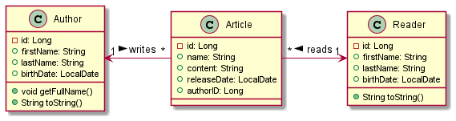
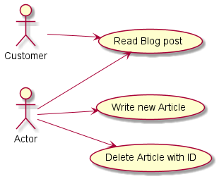

# Projekt Tageszeitung

Author: Daniel Andricic

## Beschreibung

Tageszeitung ist ein Rest-Service, welcher alle Authoren und Artikeln ordnet/speichert.
Das Projekt enthält 3 Klassen (Author, Article, Reader).

Jeder Leser kann verschiedenste Artikel lesen.
Der Author kann auch mehrere Artikel veröffentlichen.
Der Author kann auch beliebig viele Artikel nach ihrer ID suchen und löschen.

## Klassendiagramm

## Use Case Diagramm

